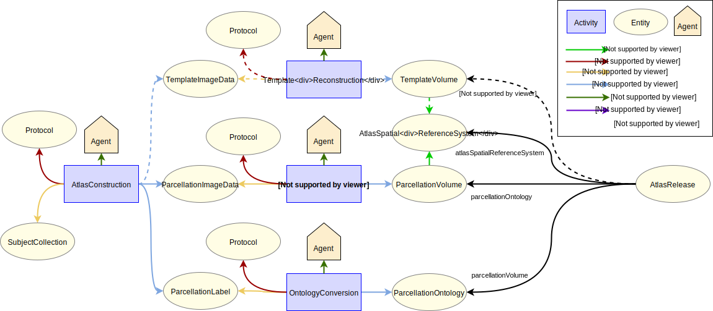

# Registering a Brain Atlas

## Use case

### Description

This specification describes the process of register a brain atlas. The process starts with a subject collection which
is imaged and processed to generate 3 derived entities: a template image data, a parcellation image data, as well as
brain parcellation labels. The first 2 entities are further transformed into volumetric representation, from which an
atlas spatial reference system is derived. The parcellation labels are converted into ontology. The final template
volume, parcellation volume, parcellation ontology as well as the atlas spatial reference system are used to form an
atlas release.

### Supported Data Queries

From a specific version of a brain atlas:

* Get the brain parcellation dataset
* Get the brain parcellation labels dataset
* Get the image stack datasets
* Get the coordinate system of the atlas spatial reference system

## Data Provenance pattern

## Schemas

### Entities

The different entity types involved are described below.

| Type  | Description|
| ------------- | ------------- |
| [SubjectCollection](https://bbp-nexus.epfl.ch/datamodels/class-subjectcollection.html)  |     A collection of subject to be used in the experiment  |
| [TemplateImageData](https://bbp-nexus.epfl.ch/datamodels/class-templateimagedata.html)  |  Template image data acquired and processed from the subject collection  |
| [ParcellationImageData](https://bbp-nexus.epfl.ch/datamodels/class-parcellationimagedata.html)  |  Parcellation image data generated from the template image data  |
| [ParcellationLabel](https://bbp-nexus.epfl.ch/datamodels/class-parcellationlabel.html)  |  Parcellation labels correspond to the annotations in the parcellation image  |
| [TemplateVolume](https://bbp-nexus.epfl.ch/datamodels/class-templatevolume.html)  |  Template volume generated from the template image data  |
| [ParcellationVolume](https://bbp-nexus.epfl.ch/datamodels/class-parcellationvolume.html)  |  Parcellation volume generated from the parcellation image data  |
| [ParcellationOntology](https://bbp-nexus.epfl.ch/datamodels/class-parcellationontology.html)  |  Parcellation ontology converted from the parcellation label  |
| [AtlasSpatialReferenceSystem](https://bbp-nexus.epfl.ch/datamodels/class-atlasspatialreferencesystem.html)  |  The spatial coordinate system of the atlas space  |
| [AtlasRelease](https://bbp-nexus.epfl.ch/datamodels/class-atlasrelease.html)  | An atlas release comprises template volume, parcellation volume, parcellation ontology as well as the atlas spatial reference system  |
| [Protocol](https://bbp-nexus.epfl.ch/datamodels/class-experimentalprotocol.html)                          |     Protocol that describes the method used in the design and execution of the experiment      |

### Activities

| Type  | Description|
| ------------- | ------------- |
| [Atlas Construction](https://bbp-nexus.epfl.ch/datamodels/class-atlasconstruction.html)   |  Process to construct a brain atlas  |
| [Template Reconstruction](https://bbp-nexus.epfl.ch/datamodels/class-templatereconstruction.html)   |  Reconstruct the template image data into volumetric representation  |
| [Parcellation Reconstruction](https://bbp-nexus.epfl.ch/datamodels/class-parcellationreconstruction.html)   |  Reconstruct the parcellation image data into volumetric representation  |
| [Ontology Conversion](https://bbp-nexus.epfl.ch/datamodels/class-ontologyconversion.html)   |  Convert the parcellation label into ontological representation  |

### Agents

| Type  | Description|
| ------------- | ------------- |
| [Person](https://bbp-nexus.epfl.ch/datamodels/class-schemaperson.html)                                        |    Person associated with an activity      |
| [SoftwareAgent](https://bbp-nexus.epfl.ch/datamodels/class-provsoftwareagent.html)                          |    Software associated with an activity      |
| [Organization](https://bbp-nexus.epfl.ch/datamodels/class-schemaorganization.html)                            |    Organization associated with an activity      |

## Contributors

* [Huanxiang Lu](mailto:huanxiang.lu@epfl.ch)
* [Anna-Kristin Kaufmann](mailto:anna-kristin.kaufmann@epfl.ch)
* [Silvia Jimenez](mailto:silvia.jimenez@epfl.ch)
* [Sy Mohameth Francois](mailto:mohameth.sy@epfl.ch)
* [Samuel Kerrien](mailto:samuel.kerrien@epfl.ch)
* [Sean Hill](mailto:sean.hill@epfl.ch)