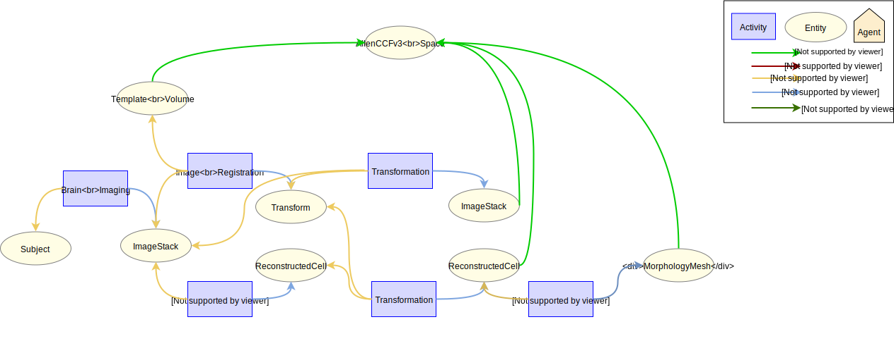

# Registering a Whole Brain Morphology in an Atlas

## Use case

### Description

This specification describes the process of register a whole brain morphology into an atlas. The process starts with
reconstruction the whole brain morphologies from image stack. The image stack is used to register to the reference atlas,
resulting in a transformation. This transformation is then used to transform the reconstructed whole brain cell into the
reference atlas space.

### Supported Data Queries

* Get the whole brain morphology from a given atlas spatial reference system.
* Get the whole brain morphologies derived from a image stack

## Data Provenance pattern

## Schemas

### Entities

The different entity types involved are described below.

| Type  | Description|
| ------------- | ------------- |
| [Subject](https://bbp.epfl.ch/schemas/neuroshapes/class-subject.html)                            |     Subject that was used in the experiment     |
| [TemplateVolume](https://bbp.epfl.ch/schemas/neuroshapes/class-templatevolume.html)  |  Template volume generated from the template image data  |
| [AtlasSpatialReferenceSystem](https://bbp.epfl.ch/schemas/neuroshapes/class-atlasspatialreferencesystem.html)  |  The spatial coordinate system of the atlas space  |
| [ImageStack](https://bbp.epfl.ch/schemas/neuroshapes/class-imagestack.html)                            |     Image stack obtained from the brain tissue of the subject     |
| [ReconstructedCell](https://bbp.epfl.ch/schemas/neuroshapes/class-reconstructedcell.html)    |     Reconstructed cell      |
| [Transform](https://bbp.epfl.ch/schemas/neuroshapes/class-transform.html)    |     A linear or non-linear transform      |
| [Protocol](https://bbp.epfl.ch/schemas/neuroshapes/class-experimentalprotocol.html)                          |     Protocol that describes the method used in the design and execution of the experiment      |

### Activities

| Type  | Description|
| ------------- | ------------- |
| [BrainImaging](https://bbp.epfl.ch/schemas/neuroshapes/class-brainimaging.html)                      |     Technique used to obtain an image stack of the brain tissue containing the cells for reconstruction      |
| [ReconstructionFromImage](https://bbp.epfl.ch/schemas/neuroshapes/class-reconstructionfromimage.html)   |     Technique used to reconstruct the stained cell     |
| [Transformation](https://bbp.epfl.ch/schemas/neuroshapes/class-transformation.html)   |     Transform a geometric object     |

### Agents

| Type  | Description|
| ------------- | ------------- |
| [Person](https://bbp.epfl.ch/schemas/neuroshapes/class-schemaperson.html)                                        |    Person associated with an activity      |
| [SoftwareAgent](https://bbp.epfl.ch/schemas/neuroshapes/class-provsoftwareagent.html)                          |    Software associated with an activity      |
| [Organization](https://bbp.epfl.ch/schemas/neuroshapes/class-schemaorganization.html)                            |    Organization associated with an activity      |

## Contributors

* [Huanxiang Lu](mailto:huanxiang.lu@epfl.ch)
* [Anna-Kristin Kaufmann](mailto:anna-kristin.kaufmann@epfl.ch)
* [Silvia Jimenez](mailto:silvia.jimenez@epfl.ch)
* [Sy Mohameth Francois](mailto:mohameth.sy@epfl.ch)
* [Samuel Kerrien](mailto:samuel.kerrien@epfl.ch)
* [Sean Hill](mailto:sean.hill@epfl.ch)
