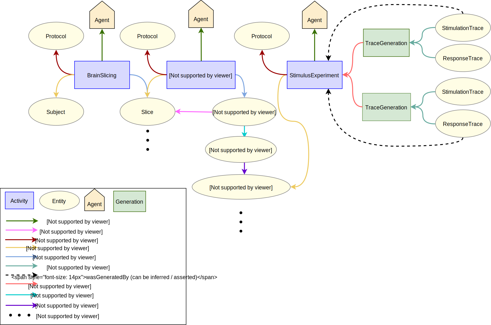

# In Vitro IntraCellular Sharp Electrode Recording

## Use case

### Description

This specification describes the metadata collected for in vitro intracellular electrophysiology recordings using  intracellular sharp electrodes
configuration. 
Metadata is collected on the subject used in the experiment, the slice, the cell 
which was recorded as well as the recording traces and protocols. Additionally, metadata for the brain slicing, the intracellular sharp electrodes and the stimulus (including protocols and agents) involved in the generation
of the recording traces are captured.

### Supported Data Queries

The following points describe an example subset of questions supported by the data provenance pattern:
 
* Retrieve all recording traces generated from rat somatosensory cortex using selected stimuli.
* Retrieve recording traces by recording day and experimenter.
* Retrieve all response traces from a specific recorded cell.

## Data Provenance pattern

## Schemas

### Entities

The different entity types involved in the experiment are listed below.

| Type  | Description|
| -------------                                                             | ------------- |
| [Subject](https://bbp.epfl.ch/schemas/neuroshapes/class-subject.html)                            |     Subject that was used in the experiment     |
| [Slice](https://bbp.epfl.ch/schemas/neuroshapes/class-slice.html)                                |     Brain slice obtained from the subject      |
| [IntraCellularSharpElectrodeRecordedSlice](https://bbp.epfl.ch/schemas/neuroshapes/class-intracellularsharpelectroderecordedslice.html)                  |     Brain slice containing recorded cells      |
| [IntraSharpRecordedCellCollection](https://bbp.epfl.ch/schemas/neuroshapes/class-intracellularsharpelectroderecordedslice.html)|     Collection of recorded cells in a single slice  |
| [IntraCellularSharpElectrodeRecordedCell](https://bbp.epfl.ch/schemas/neuroshapes/class-intracellularsharpelectroderecordedcell.html)                    |     Cell that was recorded in the slice      |
| [Trace](https://bbp.epfl.ch/schemas/neuroshapes/class-trace.html)                         |     Individual recording trace of the cell (stimulation/input and response/output trace)     |
| [Protocol](https://bbp.epfl.ch/schemas/neuroshapes/class-experimentalprotocol.html)                          |     Protocol that describes the method used in the design and execution of the experiment      |
    
### Activities

The different activity types involved in the experiment are listed below.

| Type  | Description|
| ------------- | ------------- |
| [BrainSlicing](https://bbp.epfl.ch/schemas/neuroshapes/class-brainslicing.html)                      |     Technique used to obtain a brain slice      |
| [IntraCellularSharpElectrode](https://bbp.epfl.ch/schemas/neuroshapes/class-intracellularsharpelectrode.html)        |     Technique used to study electrical activity of individual living cells    |
| [StimulusExperiment](https://bbp.epfl.ch/schemas/neuroshapes/class-stimulusexperiment.html)   |     Technique used to obtain the electrical signature of cells through injection of a defined current pattern |

### Agents

The different agent types involved in the experiment are listed below.

| Type  | Description|
| ------------- | ------------- |
| [Person](https://bbp.epfl.ch/schemas/neuroshapes/class-schemaperson.html)                                        |    Person associated with an activity      |
| [SoftwareAgent](https://bbp.epfl.ch/schemas/neuroshapes/class-provsoftwareagent.html)                          |    Software associated with an activity      |
| [Organization](https://bbp.epfl.ch/schemas/neuroshapes/class-schemaorganization.html)                            |    Organization associated with an activity      |

## Contributors

* [Andrew Davison](mailto:andrew.davison@unic.cnrs-gif.fr)
* [Anna-Kristin Kaufmann](mailto:anna-kristin.kaufmann@epfl.ch)
* [Huanxiang Lu](mailto:huanxiang.lu@epfl.ch)
* [Silvia Jimenez](mailto:silvia.jimenez@epfl.ch)
* [Sy Mohameth Francois](mailto:mohameth.sy@epfl.ch)
* [Samuel Kerrien](mailto:samuel.kerrien@epfl.ch)
* [Sean Hill](mailto:sean.hill@epfl.ch)