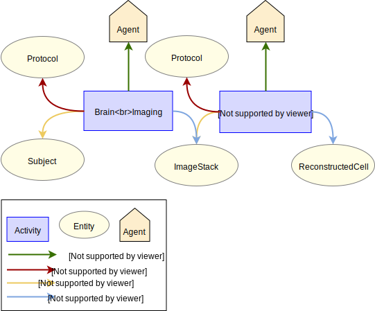

# Whole Brain Neuron Morphology Reconstruction

## Use case

### Description

This specification describes metadata collected for whole brain morphology reconstructions from a continuous whole brain image stack. Reconstruction of a neuron morphology from an image stack
is typically enabled through sparse neuronal labeling following e.g. viral delivery of a fluorescent protein. Metadata is collected on the subject used in the experiment, 
the image stack containing the labeled cells and the reconstructed neuron morphology. 
Additionally, metadata for the brain imaging and the reconstruction from image (including protocols and agents) are captured. 
 
### Supported Data Queries

The following points describe an example subset of questions supported by the data provenance pattern:

* Retrieve morphology reconstructions from a given brain region.
* Retrieve pyramidal cell reconstructions.
* Retrieve morphology reconstructions projecting to a given brain region.
* Retrieve morphology reconstructions from a subject of a given age and sex.
* Retrieve morphology reconstructions which were reconstructed by a specific person.

## Data Provenance pattern

## Entities

The different entity types involved in the experiment are listed below.

| Type  | Description|
| ------------- | ------------- |
| [Subject](https://bbp-nexus.epfl.ch/staging/datamodels/shape-neurosciencegraphcoresubjectv010shapessubjectshape.html)                            |     Subject that was used in the experiment     |
| [ImageStack](https://bbp-nexus.epfl.ch/staging/datamodels/shape-neurosciencegraphatlasimagestackv021shapesimagestackshape.html)                            |     Image stack obtained from the brain tissue of the subject     |
| [ReconstructedCell](https://bbp-nexus.epfl.ch/staging/datamodels/shape-neurosciencegraphmorphologyreconstructedcellv012shapesreconstructedcellshape.html)    |     Reconstructed cell      |
| [Protocol](https://bbp-nexus.epfl.ch/staging/datamodels/shape-neurosciencegraphcommonsexperimentalprotocolv011shapesexperimentalprotocolshape.html)                          |     Protocol that describes the method used in the design and execution of the experiment      |

## Activities

The different activity types involved in the experiment are listed below.

| Type  | Description|
| ------------- | ------------- |
| [BrainImaging](https://bbp-nexus.epfl.ch/staging/datamodels/shape-neurosciencegraphexperimentbrainimagingv010shapesbrainimagingshape.html)                      |     Technique used to obtain an image stack of the brain tissue containing the cells for reconstruction      |
| [ReconstructionFromImage](https://bbp-nexus.epfl.ch/staging/datamodels/shape-neurosciencegraphmorphologyreconstructionfromimagev010shapesreconstructionfromimageshape.html)   |     Technique used to reconstruct the stained cell     |

## Agents

The different agent types involved in the experiment are listed below.

| Type  | Description|
| ------------- | ------------- |
| [Person](https://bbp-nexus.epfl.ch/staging/datamodels/shape-neurosciencegraphcommonspersonv010shapespersonshape.html)                                        |    Person associated with an activity      |
| [SoftwareAgent](https://bbp-nexus.epfl.ch/staging/datamodels/shape-neurosciencegraphcoresoftwareagentv010shapessoftwareagentshape.html)                          |    Software associated with an activity      |
| [Organization](https://bbp-nexus.epfl.ch/staging/datamodels/shape-neurosciencegraphcommonsorganizationv010shapesorganizationshape.html)                            |    Organization associated with an activity      |

## Contributors

* [Anna-Kristin Kaufmann](mailto:anna-kristin.kaufmann@epfl.ch)
* [Huanxiang Lu](mailto:huanxiang.lu@epfl.ch)
* [Silvia Jimenez](mailto:silvia.jimenez@epfl.ch)
* [Rodrigo Perin](mailto:rodrigo.perin@epfl.ch)
* [Sy Mohameth Francois](mailto:mohameth.sy@epfl.ch)
* [Samuel Kerrien](mailto:samuel.kerrien@epfl.ch)
* [Sean Hill](mailto:sean.hill@epfl.ch)